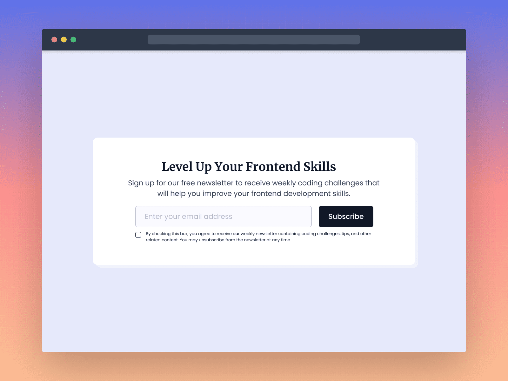

**Challenge Title**
Newsletter Card Component

**Challenge Description**
In this frontend challenge, you'll build a Newsletter Card Component. This challenge is perfect for you if you've been learning HTML and CSS and are looking to practice what you've learned by building something new and beginner-friendly.

**Difficulty Level**
Beginner

**Tags**
FRONTEND

**Learning**
In this frontend challenge, you'll learn how to build a real-world UI component using HTML & CSS. You'll also learn how to use CSS Flexbox to lay out the component and make it responsive. This frontend challenge is a great opportunity to improve your HTML & CSS skills by building a beginner-friendly frontend project. So what are you waiting for?

**Requirements**

- The Newsletter Card Component should have an email input field for the user to enter their email address and a subscribe button.
- An email input field should be validated before the user can submit the form.
- If the email address is not valid, an error alert message should be displayed to the user.
- When the user clicks on the subscribe button, a success message should be displayed to the user.
- Show the hover state of all the elements.
- The component should be responsive and display correctly on different screen sizes.
- Make this landing page look as close to the design as possible.

I hope you'll enjoy building this challenge.

Feel free to share your solution on the [website](https://www.frontendpro.dev/) or on social media and [tag us](https://twitter.com/FrontendProHQ).
